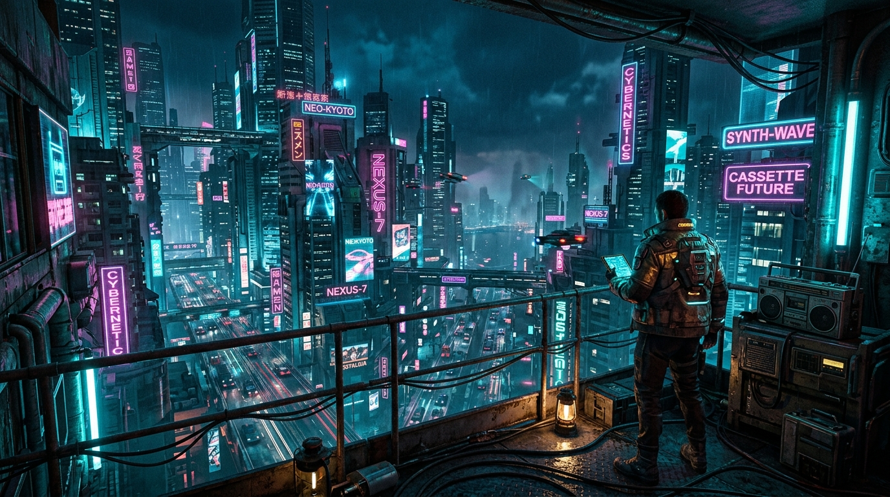

# Cyberpunk Command Terminal macOS Screensaver (`CyberpunkSaver.saver`)

A native macOS screensaver project built with **Swift** and `ScreenSaverView` that hosts a high-performance, hardware-accelerated **WKWebView** rendering an atmospheric cassette-futurist cyberpunk HUD command terminal.



## 🌟 Visual & Aesthetic Architecture

1. **Layer 1 (Background Panorama)**:
   - High-rise balcony overlooking a sprawling cyberpunk metropolis inspired by *Blade Runner* and *Neuromancer*.
   - Atmospheric neon glow, moving skybridge traffic light trails, and a **black cat silhouette** sitting on the balcony edge with smooth tail sway & ear twitch micro-animations.
2. **Layer 2 (Matrix Glyph Rain)**:
   - Full-screen HTML5 `<canvas>` rendering 25% opacity CRT green (`#00ff66`) and phosphor amber (`#ffb000`) Katakana & hex matrix streams at varied falling speeds.
3. **Layer 3 (Sci-Fi HUD Telemetry Panels)**:
   - Wireframe overlay panels inspired by the *Alien* (Nostromo) UI aesthetic:
     - **System Metrics**: Live gauges for CPU core load, RAM pressure, and Power reserve/battery status.
     - **Phoenix Environment Panel**: Live outdoor temperature, atmospheric conditions, and Air Quality Index (AQI) for Phoenix, AZ (fetched via keyless Open-Meteo REST API). Includes automatic network disconnect handling (`SIGNAL LOST // ATTEMPTING RECONNECT...`).
     - **Satellite Tracking**: Tactical radar sweep canvas and live ISS / Earth orbit stream frame.
     - **Diagnostic Terminal**: Typewriter log stream running simulated *Neuromancer* ICE-breaker console outputs.
     - **Audio**: Completely muted across all streams.

## 🚀 Performance Optimization

- **120 FPS Engine**: Uses `requestAnimationFrame()` for 120 Hz Apple ProMotion display hardware acceleration without causing CPU layout thrashing.
- **GPU Hardware Acceleration**: Forced layer promotion via `transform: translate3d(0, 0, 0)` and `will-change`.
- **Network Resilience**: Full offline detection listening to `online`/`offline` window events and fetch timeouts to show high-tech fallback states.

---

## 🛠️ Build & Installation

### Option 1: Direct Terminal Compilation (Recommended)

Run the included build script to compile the `.saver` bundle directly:

```bash
chmod +x build.sh
./build.sh
```

To install on your Mac:
```bash
open build/CyberpunkSaver.saver
```

### Option 2: Xcode Project

Open `CyberpunkSaver.xcodeproj` in Xcode and build the target:

```bash
xcodebuild -project CyberpunkSaver.xcodeproj -scheme CyberpunkSaver -configuration Release -derivedDataPath ./DerivedData build
```

---

## 📁 Repository Structure

```
screensaver-cyber/
├── CyberpunkSaver.xcodeproj/          # Xcode Project file
│   └── project.pbxproj
├── CyberpunkSaver/                    # Swift Native Source & Assets
│   ├── Info.plist                     # Bundle metadata (Principal Class: CyberpunkSaverView)
│   ├── CyberpunkSaverView.swift       # ScreenSaverView subclass wrapping WKWebView
│   └── WebContent/                    # Web Application HUD
│       ├── index.html                 # Nostromo HUD markup & cat SVG
│       ├── styles.css                 # Cassette-futurist CRT dark theme & animations
│       ├── app.js                     # 120 FPS rAF engine, Matrix rain, Weather API, Terminal
│       └── assets/
│           └── background.jpg         # 16:9 Cyberpunk balcony city backdrop
├── build.sh                           # One-step compilation script
├── README.md                          # Documentation
└── .gitignore                         # Build output exclusions
```

## 📄 License

MIT License. Free for customization and display.
